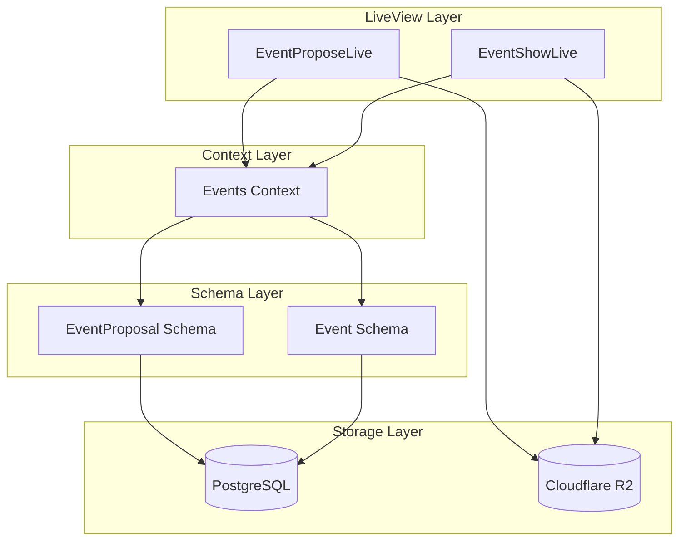

# Design Document: Online Event Enhancements

## Overview

This feature enhances the event proposal and event display system to support online meeting platform links and presentation videos. The implementation extends the existing `EventProposal` and `Event` schemas with new fields for meeting links and video references, adds validation logic for URLs and file uploads, and updates the UI components to display meeting join buttons and video players.

## Architecture

The feature follows the existing Phoenix LiveView architecture pattern:



## Components and Interfaces

### 1. Schema Changes

#### EventProposal Schema Extensions

```elixir
# New fields to add to event_proposals table
field :meeting_platform_link, :string      # URL to Teams/Zoom/Meet/etc
field :presentation_video_type, :string    # "youtube" | "r2" | nil
field :presentation_video_url, :string     # YouTube URL or R2 key
```

#### Event Schema Extensions

```elixir
# New fields to add to events table
field :meeting_platform_link, :string      # URL to Teams/Zoom/Meet/etc
field :presentation_video_type, :string    # "youtube" | "r2" | nil
field :presentation_video_url, :string     # YouTube URL or R2 key
```

### 2. Validation Module

A new validation helper module for URL validation:

```elixir
defmodule Sahajyog.Events.Validators do
  @doc "Validates HTTP/HTTPS URLs"
  def valid_url?(url)

  @doc "Validates YouTube video URLs and extracts video ID"
  def valid_youtube_url?(url)
  def extract_youtube_id(url)

  @doc "Validates meeting platform URLs"
  def valid_meeting_url?(url)
end
```

### 3. LiveView Components

#### EventProposeLive Updates

- Add meeting platform link input (shown when `is_online` is checked)
- Add presentation video section with source type selector
- Add YouTube URL input (when source is "youtube")
- Add file upload interface (when source is "r2")

#### EventShowLive Updates

- Add "Join Meeting" button for online events with meeting links
- Add video player section for events with presentation videos
- Use existing `VideoPlayer` component for YouTube videos
- Add HTML5 video player for R2-hosted videos

### 4. R2 Storage Integration

Video files will be stored under the path: `Events/{event_slug}/videos/{uuid}-{filename}`

Supported video formats:

- MP4 (video/mp4)
- WebM (video/webm)
- MOV (video/quicktime)

Maximum file size: 500MB

## Data Models

### EventProposal (Extended)

| Field                   | Type   | Description                      |
| ----------------------- | ------ | -------------------------------- |
| meeting_platform_link   | string | URL to external meeting platform |
| presentation_video_type | string | "youtube", "r2", or nil          |
| presentation_video_url  | string | YouTube URL or R2 storage key    |

### Event (Extended)

| Field                   | Type   | Description                      |
| ----------------------- | ------ | -------------------------------- |
| meeting_platform_link   | string | URL to external meeting platform |
| presentation_video_type | string | "youtube", "r2", or nil          |
| presentation_video_url  | string | YouTube URL or R2 storage key    |

## Correctness Properties

_A property is a characteristic or behavior that should hold true across all valid executions of a system-essentially, a formal statement about what the system should do. Properties serve as the bridge between human-readable specifications and machine-verifiable correctness guarantees._

### Property Reflection

After analyzing the acceptance criteria, the following redundancies were identified:

- Properties 1.2 and 1.3 can be combined into a single URL validation property
- Properties 4.1 and 4.2 can be combined into a single data persistence property
- Properties 2.5 and 2.6 relate to file upload but test different aspects (location vs format)

### Properties

**Property 1: Meeting URL Validation**
_For any_ string input to the meeting platform link field, the validation SHALL accept only valid HTTP or HTTPS URLs, including URLs from common meeting platforms (Teams, Zoom, Google Meet, Webex).
**Validates: Requirements 1.2, 1.3**

**Property 2: YouTube URL Validation**
_For any_ string input to the YouTube video URL field, the validation SHALL accept only URLs matching valid YouTube video URL patterns (youtube.com/watch, youtu.be, youtube.com/embed).
**Validates: Requirements 2.3**

**Property 3: Video File Format Validation**
_For any_ uploaded video file, the system SHALL accept only files with supported MIME types (video/mp4, video/webm, video/quicktime).
**Validates: Requirements 2.6**

**Property 4: R2 Storage Path Format**
_For any_ uploaded video file for an event, the R2 storage key SHALL follow the pattern `Events/{event_slug}/videos/{uuid}-{filename}`.
**Validates: Requirements 2.5**

**Property 5: Data Persistence Round-Trip**
_For any_ event proposal with meeting link and video data, after saving and retrieving from the database, the meeting_platform_link, presentation_video_type, and presentation_video_url fields SHALL contain the same values.
**Validates: Requirements 4.1, 4.2**

**Property 6: Proposal to Event Data Transfer**
_For any_ approved event proposal with meeting link and video data, the resulting event record SHALL contain the same meeting_platform_link, presentation_video_type, and presentation_video_url values as the original proposal.
**Validates: Requirements 4.3**

## Error Handling

### URL Validation Errors

- Invalid URL format: Display "Please enter a valid URL starting with http:// or https://"
- Invalid YouTube URL: Display "Please enter a valid YouTube video URL"

### File Upload Errors

- Invalid file type: Display "Please upload a video file (MP4, WebM, or MOV)"
- File too large: Display "Video file must be less than 500MB"
- Upload failure: Display "Failed to upload video. Please try again."

### Video Playback Errors

- R2 video unavailable: Display placeholder with "Video unavailable" message
- YouTube video unavailable: YouTube embed handles this natively

## Testing Strategy

### Dual Testing Approach

This feature will use both unit tests and property-based tests:

1. **Unit Tests**: Verify specific examples, edge cases, and integration points
2. **Property-Based Tests**: Verify universal properties across all valid inputs

### Property-Based Testing Library

The project will use **StreamData** (already included in deps) for property-based testing in Elixir.

Each property-based test will:

- Run a minimum of 100 iterations
- Be tagged with a comment referencing the correctness property
- Use the format: `**Feature: online-event-enhancements, Property {number}: {property_text}**`

### Test Categories

#### Schema/Changeset Tests

- Meeting URL validation (Property 1)
- YouTube URL validation (Property 2)
- Data persistence round-trip (Property 5)

#### Context Tests

- Proposal to event data transfer (Property 6)
- R2 video cleanup on event deletion

#### LiveView Tests

- Form rendering with online event checkbox
- Meeting link field visibility toggle
- Video source type selection
- Join Meeting button rendering
- Video player rendering (YouTube and R2)

#### Integration Tests

- Full proposal creation flow with meeting link and video
- Event display with meeting link and video player
