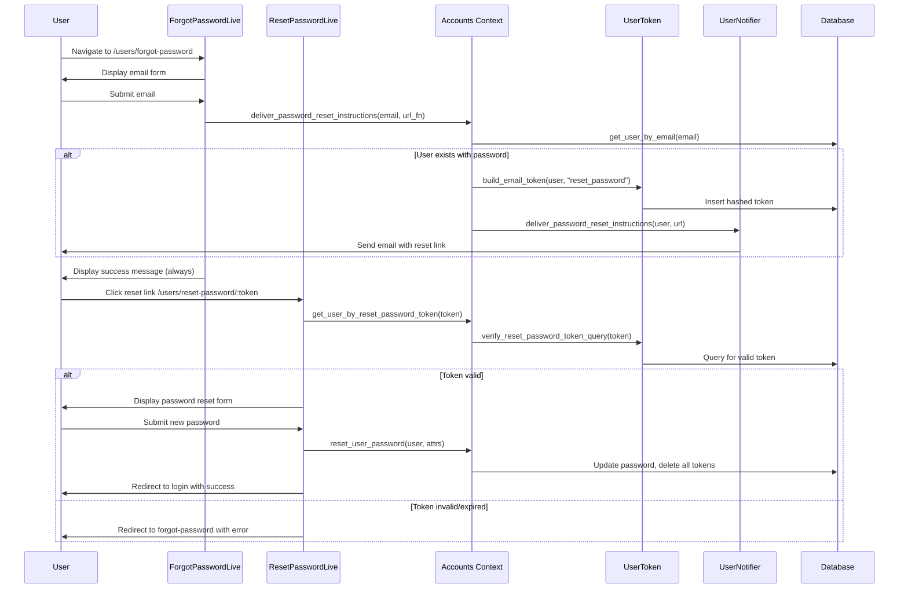

# Design Document

## Overview

The password recovery feature enables users who have registered with a password to reset their forgotten password through a secure, token-based email verification flow. The implementation leverages the existing `UserToken` infrastructure for token generation and validation, and the `UserNotifier` module for email delivery.

The flow consists of three main stages:

1. **Request Stage**: User requests a password reset via email
2. **Verification Stage**: User clicks the emailed link containing a secure token
3. **Reset Stage**: User enters and confirms a new password

## Architecture



## Components and Interfaces

### 1. LiveView Components

#### ForgotPasswordLive (`lib/sahajyog_web/live/user_live/forgot_password.ex`)

Handles the password reset request form.

```elixir
defmodule SahajyogWeb.UserLive.ForgotPassword do
  use SahajyogWeb, :live_view

  # Assigns:
  # - form: Phoenix form for email input

  # Events:
  # - "send_instructions": Processes email submission
end
```

#### ResetPasswordLive (`lib/sahajyog_web/live/user_live/reset_password.ex`)

Handles the password reset form after token verification.

```elixir
defmodule SahajyogWeb.UserLive.ResetPassword do
  use SahajyogWeb, :live_view

  # Assigns:
  # - user: The user associated with the valid token
  # - form: Phoenix form for password input
  # - token: The reset token from URL

  # Events:
  # - "validate": Live validation of password
  # - "reset": Processes password reset
end
```

### 2. Context Functions (Accounts)

New functions to add to `lib/sahajyog/accounts.ex`:

```elixir
@doc """
Delivers password reset instructions to the user's email.
Returns {:ok, email} if user exists with password, {:ok, :no_op} otherwise.
"""
@spec deliver_password_reset_instructions(String.t(), (String.t() -> String.t()), String.t()) ::
        {:ok, Swoosh.Email.t()} | {:ok, :no_op}
def deliver_password_reset_instructions(email, reset_url_fun, locale \\ "en")

@doc """
Gets a user by reset password token.
Returns the user if token is valid, nil otherwise.
"""
@spec get_user_by_reset_password_token(String.t()) :: User.t() | nil
def get_user_by_reset_password_token(token)

@doc """
Resets the user password and invalidates all tokens.
"""
@spec reset_user_password(User.t(), map()) :: {:ok, User.t()} | {:error, Ecto.Changeset.t()}
def reset_user_password(user, attrs)
```

### 3. Token Functions (UserToken)

New functions to add to `lib/sahajyog/accounts/user_token.ex`:

```elixir
@reset_password_validity_in_minutes 60

@doc """
Verifies the reset password token and returns a query for the user.
"""
@spec verify_reset_password_token_query(String.t()) :: {:ok, Ecto.Query.t()} | :error
def verify_reset_password_token_query(token)
```

### 4. Notifier Functions (UserNotifier)

New function to add to `lib/sahajyog/accounts/user_notifier.ex`:

```elixir
@doc """
Delivers password reset instructions to the user.
"""
@spec deliver_password_reset_instructions(User.t(), String.t(), String.t()) ::
        {:ok, Swoosh.Email.t()} | {:error, term()}
def deliver_password_reset_instructions(user, url, locale \\ "en")
```

### 5. Router Updates

Add new routes to `lib/sahajyog_web/router.ex`:

```elixir
# In the :current_user live_session (public routes)
live "/users/forgot-password", UserLive.ForgotPassword, :new
live "/users/reset-password/:token", UserLive.ResetPassword, :edit
```

## Data Models

### Existing Models Used

#### UserToken Schema

The existing `users_tokens` table will be used with a new context value:

- `context: "reset_password"` - For password reset tokens

No schema changes required. The token will be stored with:

- `token`: Hashed token (binary)
- `context`: "reset_password"
- `sent_to`: User's email
- `user_id`: Reference to user
- `inserted_at`: Timestamp for expiry calculation

#### User Schema

No changes required. Uses existing:

- `hashed_password`: For password storage
- `password`: Virtual field for input

## Correctness Properties

_A property is a characteristic or behavior that should hold true across all valid executions of a system-essentially, a formal statement about what the system should do. Properties serve as the bridge between human-readable specifications and machine-verifiable correctness guarantees._

Based on the acceptance criteria analysis, the following properties must hold:

### Property 1: Token generation for password users creates valid, hashed tokens with reset URLs

_For any_ user with a password in the system, when a password reset is requested for their email, the system should:

- Generate a cryptographically secure token
- Store a hashed version of the token in the database
- Send an email containing a URL with the unhashed token

**Validates: Requirements 1.3, 2.1, 2.2, 2.3**

### Property 2: Email enumeration prevention

_For any_ email address submitted to the forgot password form (whether it exists in the system or not), the system should display the same success message and take approximately the same time to respond.

**Validates: Requirements 1.4**

### Property 3: Invalid email format rejection

_For any_ string that is not a valid email format (missing @, contains spaces, empty string, whitespace-only), the forgot password form should reject the submission with a validation error.

**Validates: Requirements 1.5**

### Property 4: Valid token grants form access

_For any_ valid, non-expired reset password token, navigating to the reset URL should display the password reset form with the associated user context.

**Validates: Requirements 3.1**

### Property 5: Password validation enforcement

_For any_ password submitted to the reset form, if the password is shorter than 12 characters, the system should reject it with a validation error. If the password is 12 or more characters (up to 72), the system should accept it.

**Validates: Requirements 3.4**

### Property 6: Password reset invalidates all sessions

_For any_ successful password reset, all existing session tokens for that user should be deleted from the database, and the user's password should be updated to the new hashed value.

**Validates: Requirements 3.5, 4.3**

### Property 7: Token single-use enforcement

_For any_ reset password token that has been successfully used to reset a password, subsequent attempts to use the same token should fail with an invalid token error.

**Validates: Requirements 4.1**

### Property 8: New reset request invalidates previous tokens

_For any_ user who requests multiple password resets, only the most recently generated token should be valid. All previously generated reset tokens for that user should be invalid.

**Validates: Requirements 4.2**

### Property 9: Email content respects locale

_For any_ password reset email sent, the email content should be in the language corresponding to the locale parameter passed to the delivery function.

**Validates: Requirements 5.2**

## Error Handling

### Request Stage Errors

| Error Condition        | Handling                                   |
| ---------------------- | ------------------------------------------ |
| Empty email            | Display validation error, do not submit    |
| Invalid email format   | Display validation error, do not submit    |
| Email not in system    | Show success message (prevent enumeration) |
| User has no password   | Show success message, do not send email    |
| Email delivery failure | Log error, show success message to user    |

### Reset Stage Errors

| Error Condition               | Handling                                     |
| ----------------------------- | -------------------------------------------- |
| Invalid token format          | Redirect to forgot-password with error flash |
| Expired token (>60 min)       | Redirect to forgot-password with error flash |
| Already-used token            | Redirect to forgot-password with error flash |
| Password too short            | Display validation error on form             |
| Password too long (>72 bytes) | Display validation error on form             |
| Database error                | Display generic error, log details           |

### Flash Messages

All flash messages will be internationalized using Gettext:

```elixir
# Success messages
gettext("If your email is in our system and has a password, you will receive reset instructions shortly.")
gettext("Password reset successfully. Please log in with your new password.")

# Error messages
gettext("Reset password link is invalid or has expired.")
gettext("is too short (minimum 12 characters)")
```

## Testing Strategy

### Property-Based Testing

The implementation will use `StreamData` (already included in the project) for property-based testing. Each correctness property will be implemented as a property-based test.

**Configuration:**

- Minimum 100 iterations per property test
- Tests will be tagged with the property number and requirements reference

**Test file:** `test/sahajyog/accounts_password_reset_test.exs`

### Unit Tests

Unit tests will cover:

- `UserToken.verify_reset_password_token_query/1` - token verification logic
- `Accounts.deliver_password_reset_instructions/3` - email delivery orchestration
- `Accounts.reset_user_password/2` - password update and token cleanup
- `UserNotifier.deliver_password_reset_instructions/3` - email content generation

### Integration Tests (LiveView)

LiveView tests will verify:

- ForgotPasswordLive form rendering and submission
- ResetPasswordLive form rendering, validation, and submission
- Navigation flows and flash messages
- Locale handling in UI

**Test files:**

- `test/sahajyog_web/live/user_live/forgot_password_live_test.exs`
- `test/sahajyog_web/live/user_live/reset_password_live_test.exs`
