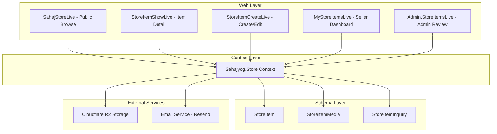
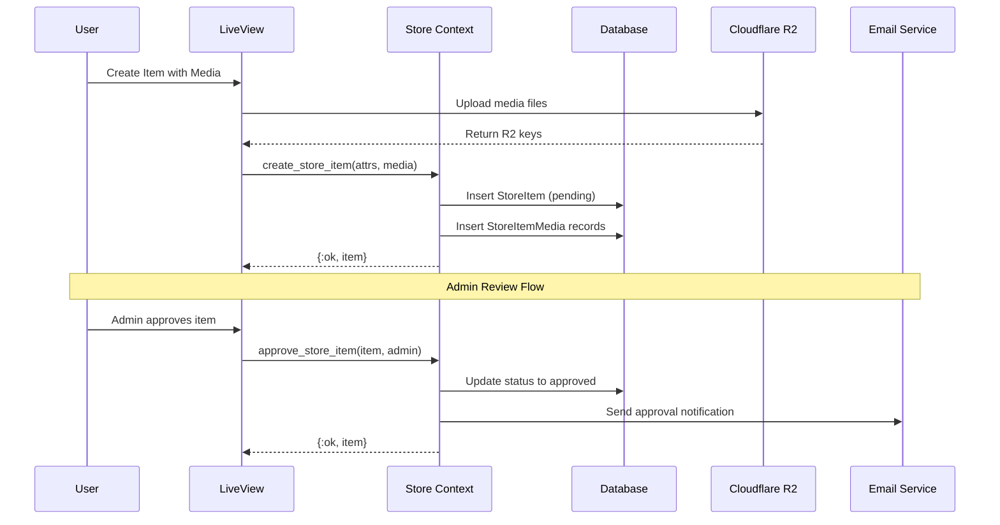

# SahajStore Design Document

## Overview

SahajStore is a community marketplace feature integrated into the Sahajyog Phoenix application. It enables authenticated users to list items for sale or donation, with an admin approval workflow ensuring quality control. The feature leverages existing patterns from the codebase including R2 storage for media, email notifications, and the established approval workflow pattern used in EventProposal and TopicProposal.

### Key Features

- Item listing with photos (max 5) and video (max 1)
- Flexible pricing: fixed price or donation-based
- Multiple delivery options
- Admin approval workflow
- Buyer inquiry system with quantity selection
- Seller dashboard for managing listings

## Architecture



### Request Flow



## Components and Interfaces

### Context Module: `Sahajyog.Store`

```elixir
defmodule Sahajyog.Store do
  @moduledoc """
  The Store context for managing SahajStore marketplace items.
  """

  # Item CRUD
  def list_approved_items(opts \\ [])
  def list_pending_items()
  def list_user_items(user_id)
  def get_item!(id)
  def get_item_with_media!(id)
  def create_item(attrs, user)
  def update_item(item, attrs, user)
  def delete_item(item)
  def mark_item_sold(item)

  # Admin actions
  def approve_item(item, admin, opts \\ [])
  def reject_item(item, admin, review_notes)

  # Media management
  def add_media(item, media_attrs)
  def delete_media(media)
  def count_photos(item_id)
  def count_videos(item_id)

  # Inquiries
  def create_inquiry(item, buyer, attrs)
  def list_inquiries_for_item(item_id)
  def list_inquiries_for_seller(user_id)

  # Changesets
  def change_item(item, attrs \\ %{})
  def change_inquiry(inquiry, attrs \\ %{})
end
```

### LiveView Components

| Component              | Route                           | Purpose                                        |
| ---------------------- | ------------------------------- | ---------------------------------------------- |
| `SahajStoreLive`       | `/store`                        | Public browse page for approved items          |
| `StoreItemShowLive`    | `/store/:id`                    | Item detail view with gallery and inquiry form |
| `StoreItemCreateLive`  | `/store/new`, `/store/:id/edit` | Create/edit item form with media upload        |
| `MyStoreItemsLive`     | `/store/my-items`               | Seller dashboard                               |
| `Admin.StoreItemsLive` | `/admin/store-items`            | Admin review panel                             |

### R2 Storage Integration

Extends existing `Sahajyog.Resources.R2Storage` module:

```elixir
# Key format for store items
def generate_store_item_key(item_id, filename, media_type) do
  uuid = Ecto.UUID.generate() |> String.slice(0, 8)
  sanitized = sanitize_filename(filename)
  "sahajaonline/sahajstore/#{item_id}/#{media_type}/#{uuid}-#{sanitized}"
end
```

### Email Notifications

New notifier module `Sahajyog.Store.StoreNotifier`:

```elixir
defmodule Sahajyog.Store.StoreNotifier do
  def deliver_item_approved(item, seller)
  def deliver_item_rejected(item, seller, review_notes)
  def deliver_inquiry_to_seller(inquiry, item, seller, buyer)
end
```

## Data Models

### StoreItem Schema

```elixir
defmodule Sahajyog.Store.StoreItem do
  use Ecto.Schema

  @statuses ~w(pending approved rejected sold)
  @pricing_types ~w(fixed_price accepts_donation)
  @delivery_methods ~w(express_delivery in_person local_pickup shipping)

  schema "store_items" do
    field :name, :string
    field :description, :string
    field :quantity, :integer
    field :production_cost, :decimal
    field :price, :decimal
    field :pricing_type, :string, default: "fixed_price"
    field :status, :string, default: "pending"
    field :review_notes, :string

    # Delivery options (stored as array or JSONB)
    field :delivery_methods, {:array, :string}, default: []
    field :shipping_cost, :decimal
    field :shipping_regions, :string
    field :meeting_location, :string

    # Seller visibility preferences
    field :phone_visible, :boolean, default: false

    belongs_to :user, Sahajyog.Accounts.User
    belongs_to :reviewed_by, Sahajyog.Accounts.User

    has_many :media, Sahajyog.Store.StoreItemMedia
    has_many :inquiries, Sahajyog.Store.StoreItemInquiry

    timestamps(type: :utc_datetime)
  end
end
```

### StoreItemMedia Schema

```elixir
defmodule Sahajyog.Store.StoreItemMedia do
  use Ecto.Schema

  @media_types ~w(photo video)
  @max_photo_size 50 * 1024 * 1024      # 50MB
  @max_video_size 500 * 1024 * 1024     # 500MB

  schema "store_item_media" do
    field :file_name, :string
    field :content_type, :string
    field :file_size, :integer
    field :r2_key, :string
    field :media_type, :string  # "photo" or "video"
    field :position, :integer, default: 0

    belongs_to :store_item, Sahajyog.Store.StoreItem

    timestamps(type: :utc_datetime)
  end
end
```

### StoreItemInquiry Schema

```elixir
defmodule Sahajyog.Store.StoreItemInquiry do
  use Ecto.Schema

  schema "store_item_inquiries" do
    field :message, :string
    field :requested_quantity, :integer

    belongs_to :store_item, Sahajyog.Store.StoreItem
    belongs_to :buyer, Sahajyog.Accounts.User

    timestamps(type: :utc_datetime)
  end
end
```

### Database Migration

```elixir
def change do
  create table(:store_items) do
    add :name, :string, null: false
    add :description, :text
    add :quantity, :integer, null: false, default: 1
    add :production_cost, :decimal, precision: 10, scale: 2
    add :price, :decimal, precision: 10, scale: 2
    add :pricing_type, :string, null: false, default: "fixed_price"
    add :status, :string, null: false, default: "pending"
    add :review_notes, :text
    add :delivery_methods, {:array, :string}, default: []
    add :shipping_cost, :decimal, precision: 10, scale: 2
    add :shipping_regions, :string
    add :meeting_location, :string
    add :phone_visible, :boolean, default: false
    add :user_id, references(:users, on_delete: :delete_all), null: false
    add :reviewed_by_id, references(:users, on_delete: :nilify_all)

    timestamps(type: :utc_datetime)
  end

  create index(:store_items, [:user_id])
  create index(:store_items, [:status])

  create table(:store_item_media) do
    add :file_name, :string, null: false
    add :content_type, :string, null: false
    add :file_size, :integer, null: false
    add :r2_key, :string, null: false
    add :media_type, :string, null: false
    add :position, :integer, default: 0
    add :store_item_id, references(:store_items, on_delete: :delete_all), null: false

    timestamps(type: :utc_datetime)
  end

  create unique_index(:store_item_media, [:r2_key])
  create index(:store_item_media, [:store_item_id])

  create table(:store_item_inquiries) do
    add :message, :text, null: false
    add :requested_quantity, :integer, null: false, default: 1
    add :store_item_id, references(:store_items, on_delete: :delete_all), null: false
    add :buyer_id, references(:users, on_delete: :delete_all), null: false

    timestamps(type: :utc_datetime)
  end

  create index(:store_item_inquiries, [:store_item_id])
  create index(:store_item_inquiries, [:buyer_id])
end
```

## Correctness Properties

_A property is a characteristic or behavior that should hold true across all valid executions of a system-essentially, a formal statement about what the system should do. Properties serve as the bridge between human-readable specifications and machine-verifiable correctness guarantees._

Based on the prework analysis, the following correctness properties have been identified:

### Property 1: Item creation preserves all required fields

_For any_ valid store item attributes (name, description, quantity, production_cost, pricing_type, delivery_methods), creating a store item should result in a record where all provided fields match the input values and inserted_at timestamp is set.
**Validates: Requirements 1.1, 1.5**

### Property 2: Item-user association integrity

_For any_ store item created by a user, the item's user_id should match the creating user's id, and the user association should be retrievable.
**Validates: Requirements 1.2**

### Property 3: Phone visibility controls display

_For any_ store item with phone_visible set to true, the seller's phone should be included in public display data; when phone_visible is false, the phone should be excluded from public display data.
**Validates: Requirements 1.3, 1.4, 5.5**

### Property 4: Fixed price requires price field

_For any_ store item with pricing_type "fixed_price", the changeset should be invalid if price is nil or non-positive; for pricing_type "accepts_donation", the changeset should be valid regardless of price value.
**Validates: Requirements 1.6, 1.7, 8.5**

### Property 5: Photo count limit enforcement

_For any_ store item, adding photos should succeed when total photo count is less than or equal to 5, and should fail when attempting to exceed 5 photos.
**Validates: Requirements 2.1, 2.3**

### Property 6: Video count limit enforcement

_For any_ store item, adding a video should succeed when video count is 0, and should fail when attempting to add a second video.
**Validates: Requirements 2.2, 2.4**

### Property 7: R2 key format consistency

_For any_ store item media, the generated R2 key should match the pattern "sahajaonline/sahajstore/{item_id}/{media_type}/{uuid}-{filename}".
**Validates: Requirements 2.5**

### Property 8: Media metadata completeness

_For any_ uploaded media, the created StoreItemMedia record should have non-nil values for file_name, content_type, r2_key, and media_type.
**Validates: Requirements 2.6**

### Property 9: Photo content type validation

_For any_ media with media_type "photo", the content_type should be one of: image/jpeg, image/png, image/webp, image/gif.
**Validates: Requirements 2.7**

### Property 10: Video content type validation

_For any_ media with media_type "video", the content_type should be one of: video/mp4, video/webm, video/quicktime.
**Validates: Requirements 2.8**

### Property 11: Delivery method requirement

_For any_ store item, the changeset should be invalid if delivery_methods array is empty.
**Validates: Requirements 3.1**

### Property 12: Multiple delivery methods storage

_For any_ store item with multiple delivery methods selected, all selected methods should be stored in the delivery_methods array.
**Validates: Requirements 3.6**

### Property 13: New items default to pending status

_For any_ newly created store item, the status should be "pending".
**Validates: Requirements 4.1**

### Property 14: Pending items query accuracy

_For any_ set of store items with mixed statuses, list_pending_items should return exactly those items with status "pending".
**Validates: Requirements 4.2**

### Property 15: Approval state transition

_For any_ pending store item, approving it should set status to "approved" and set reviewed_by_id to the admin's user_id.
**Validates: Requirements 4.3**

### Property 16: Rejection requires review notes

_For any_ store item rejection attempt, the operation should fail if review_notes is empty or nil.
**Validates: Requirements 4.4**

### Property 17: Public listing shows only approved items

_For any_ set of store items with mixed statuses, list_approved_items should return exactly those items with status "approved".
**Validates: Requirements 4.6, 5.1**

### Property 18: Inquiry quantity validation

_For any_ inquiry submission, the requested_quantity should be validated to be greater than 0 and less than or equal to the item's available quantity.
**Validates: Requirements 5.6, 5.7**

### Property 19: Inquiry record completeness

_For any_ submitted inquiry, the created StoreItemInquiry record should have non-nil values for buyer_id, store_item_id, requested_quantity, message, and inserted_at.
**Validates: Requirements 5.8**

### Property 20: User items query returns all statuses

_For any_ user with store items in various statuses, list_user_items should return all items belonging to that user regardless of status.
**Validates: Requirements 6.1**

### Property 21: Edit resets approved status to pending

_For any_ store item with status "approved", updating the item should reset the status to "pending".
**Validates: Requirements 6.2**

### Property 22: Mark sold state transition

_For any_ store item, marking it as sold should set status to "sold".
**Validates: Requirements 6.3**

### Property 23: Item deletion cascades to media

_For any_ store item with associated media, deleting the item should also delete all associated StoreItemMedia records.
**Validates: Requirements 6.4**

### Property 24: Name validation constraints

_For any_ store item changeset, name must be present and have length <= 200 characters.
**Validates: Requirements 8.1**

### Property 25: Description length constraint

_For any_ store item changeset, description length must be <= 2000 characters.
**Validates: Requirements 8.2**

### Property 26: Quantity positive integer validation

_For any_ store item changeset, quantity must be a positive integer (> 0).
**Validates: Requirements 8.3**

### Property 27: Production cost non-negative validation

_For any_ store item changeset, production_cost must be >= 0.
**Validates: Requirements 8.4**

### Property 28: Media file size validation

_For any_ media upload, photos must be <= 50MB and videos must be <= 500MB.
**Validates: Requirements 8.6**

### Property 29: Store item JSON round-trip

_For any_ valid StoreItem struct, serializing to JSON and deserializing back should produce an equivalent structure.
**Validates: Requirements 8.7**

## Error Handling

### Validation Errors

- Invalid field values return `{:error, changeset}` with detailed error messages
- Media upload failures return `{:error, reason}` with specific error type
- Quantity exceeded errors include available quantity in message

### R2 Storage Errors

- Upload failures are caught and logged, returning `{:error, :upload_failed}`
- Delete failures are logged but don't block item deletion (orphaned files cleaned up by background job)
- Presigned URL generation failures return fallback error message

### Authorization Errors

- Non-owners attempting to edit/delete items receive `{:error, :unauthorized}`
- Non-admins attempting approval/rejection receive `{:error, :unauthorized}`

### State Transition Errors

- Invalid status transitions (e.g., approving a sold item) return `{:error, :invalid_transition}`

## Testing Strategy

### Property-Based Testing Library

The project will use **StreamData** (already included in deps) for property-based testing.

### Unit Tests

- Schema changeset validations
- Context function behavior
- Email notification content
- R2 key generation

### Property-Based Tests

Each correctness property will be implemented as a property-based test using StreamData generators:

```elixir
# Example generator for store items
def store_item_generator do
  gen all(
    name <- string(:alphanumeric, min_length: 1, max_length: 200),
    description <- string(:alphanumeric, max_length: 2000),
    quantity <- positive_integer(),
    production_cost <- float(min: 0.0, max: 10000.0),
    pricing_type <- member_of(["fixed_price", "accepts_donation"]),
    delivery_methods <- list_of(member_of(["express_delivery", "in_person", "local_pickup", "shipping"]), min_length: 1)
  ) do
    %{
      name: name,
      description: description,
      quantity: quantity,
      production_cost: Decimal.from_float(production_cost),
      pricing_type: pricing_type,
      delivery_methods: Enum.uniq(delivery_methods)
    }
  end
end
```

### Test Annotations

Each property-based test will be annotated with the format:

```elixir
# **Feature: sahaj-store, Property 1: Item creation preserves all required fields**
```

### Integration Tests

- Full item creation flow with media upload
- Admin approval workflow
- Buyer inquiry submission
- Seller item management

### Test Configuration

- Property tests configured for minimum 100 iterations
- Database tests use sandbox for isolation
- R2 operations mocked in test environment
