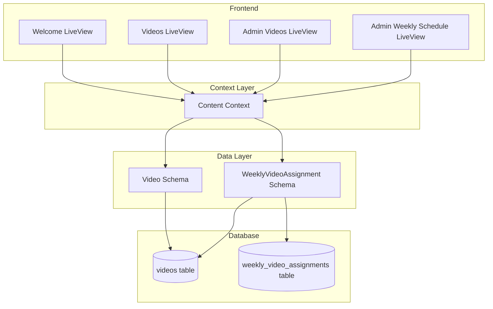

# Design Document: Video Access Control and Pools

## Overview

This feature extends the existing video management system with two major capabilities:

1. **Level-based Access Control**: Restricts video categories based on user access levels, mirroring the existing resource access control pattern
2. **Video Pools with Scheduled Rotation**: Introduces daily rotation for Welcome videos and weekly scheduling for Advanced Topics and Excerpts

The design leverages the existing `Content` context and `Video` schema while adding new fields and a join table for weekly assignments.

## Architecture



## Components and Interfaces

### 1. Video Schema Extensions

The existing `Video` schema will be extended with new fields:

```elixir
# lib/sahajyog/content/video.ex
schema "videos" do
  # Existing fields...
  field :title, :string
  field :url, :string
  field :category, :string
  field :description, :string
  field :thumbnail_url, :string
  field :duration, :string
  field :step_number, :integer
  field :provider, :string, default: "youtube"
  field :user_id, :id

  # New fields for pool management
  field :pool_position, :integer  # Position in Welcome pool (1-31), nil if not in pool
  field :in_pool, :boolean, default: false  # Whether video is in the rotation pool

  has_many :weekly_assignments, Sahajyog.Content.WeeklyVideoAssignment

  timestamps(type: :utc_datetime)
end
```

### 2. WeeklyVideoAssignment Schema (New)

```elixir
# lib/sahajyog/content/weekly_video_assignment.ex
defmodule Sahajyog.Content.WeeklyVideoAssignment do
  use Ecto.Schema
  import Ecto.Changeset

  schema "weekly_video_assignments" do
    field :year, :integer
    field :week_number, :integer  # ISO week 1-53

    belongs_to :video, Sahajyog.Content.Video

    timestamps(type: :utc_datetime)
  end
end
```

### 3. Content Context Extensions

New functions to be added to `Sahajyog.Content`:

```elixir
# Access Control
def list_videos_for_user(user)
def list_videos_for_user(user, category)
def accessible_categories(user)

# Welcome Pool Management
def list_welcome_pool_videos()
def add_to_welcome_pool(video_id)
def remove_from_welcome_pool(video_id)
def reorder_welcome_pool(video_ids)  # List of IDs in new order
def shuffle_welcome_pool()
def get_daily_video()  # Returns today's video based on rotation

# Weekly Schedule Management
def list_weekly_assignments(year, week_number, category)
def assign_videos_to_week(video_ids, year, week_number)
def remove_video_from_week(video_id, year, week_number)
def get_videos_for_current_week(category)
```

### 4. Access Level Configuration

```elixir
# Category access rules
@category_access %{
  "Welcome" => [:public, "Level1", "Level2", "Level3"],
  "Getting Started" => ["Level1", "Level2", "Level3"],
  "Advanced Topics" => ["Level1", "Level2"],
  "Excerpts" => ["Level1", "Level2"]
}
```

## Data Models

### Database Migration: Add Pool Fields to Videos

```elixir
alter table(:videos) do
  add :pool_position, :integer
  add :in_pool, :boolean, default: false
end

create index(:videos, [:category, :in_pool])
create index(:videos, [:pool_position], where: "in_pool = true")
```

### Database Migration: Weekly Video Assignments

```elixir
create table(:weekly_video_assignments) do
  add :year, :integer, null: false
  add :week_number, :integer, null: false
  add :video_id, references(:videos, on_delete: :delete_all), null: false

  timestamps(type: :utc_datetime)
end

create unique_index(:weekly_video_assignments, [:video_id, :year, :week_number])
create index(:weekly_video_assignments, [:year, :week_number])
```

## Correctness Properties

_A property is a characteristic or behavior that should hold true across all valid executions of a system-essentially, a formal statement about what the system should do. Properties serve as the bridge between human-readable specifications and machine-verifiable correctness guarantees._

### Property 1: Access Control by Level

_For any_ user with a given access level (Level1, Level2, Level3, or nil/unauthenticated), when requesting videos, all returned videos SHALL have categories that are permitted for that access level according to the access rules:

- nil/unauthenticated: only "Welcome"
- Level3: "Welcome", "Getting Started"
- Level2: "Welcome", "Getting Started", "Advanced Topics", "Excerpts"
- Level1: "Welcome", "Getting Started", "Advanced Topics", "Excerpts"

**Validates: Requirements 3.1, 3.2, 3.3, 3.4**

### Property 2: Daily Rotation Cycle

_For any_ Welcome pool with N videos (N >= 1) and any day counter D, the selected video position SHALL equal `((D - 1) mod N) + 1`, ensuring:

- Day 1 selects position 1
- Day N selects position N
- Day N+1 selects position 1 (wrap-around)

**Validates: Requirements 5.1, 5.2, 5.3, 6.2**

### Property 3: Daily Video Determinism

_For any_ fixed day and Welcome pool state, calling `get_daily_video()` multiple times SHALL return the same video, regardless of the caller's authentication status.

**Validates: Requirements 1.1, 1.2, 5.5**

### Property 4: Pool Position Validity

_For any_ video added to the Welcome pool, its `pool_position` SHALL be an integer between 1 and 31 inclusive, and no two videos in the pool SHALL have the same position.

**Validates: Requirements 2.1**

### Property 5: Pool Reorder Consistency

_For any_ list of video IDs representing a new order, after calling `reorder_welcome_pool(video_ids)`, the videos SHALL have positions 1 through N matching the order of IDs in the input list, and `get_daily_video()` SHALL return the video at the position calculated for the current day.

**Validates: Requirements 2.3, 6.3**

### Property 6: Pool Removal Renumbering

_For any_ Welcome pool with N videos and any video removed from the pool, the remaining N-1 videos SHALL have sequential positions from 1 to N-1 with no gaps.

**Validates: Requirements 2.5**

### Property 7: Pool Shuffle Validity

_For any_ Welcome pool with N videos, after calling `shuffle_welcome_pool()`, all N videos SHALL remain in the pool with positions 1 through N (no duplicates, no gaps).

**Validates: Requirements 2.6**

### Property 8: Weekly Assignment Storage

_For any_ list of video IDs, year, and week number, after calling `assign_videos_to_week(video_ids, year, week_number)`, querying assignments for that year/week SHALL return exactly those video IDs.

**Validates: Requirements 4.1, 7.3**

### Property 9: Weekly Video Retrieval

_For any_ year and week number with assigned videos in a category, calling `get_videos_for_current_week(category)` with that date context SHALL return exactly the videos assigned to that week for that category.

**Validates: Requirements 4.2, 4.3, 5.4**

### Property 10: Weekly Assignment Partial Removal

_For any_ week with multiple video assignments, removing one video from that week SHALL preserve all other video assignments for that week.

**Validates: Requirements 7.4**

## Error Handling

### Access Control Errors

| Error Condition                   | Handling                                   |
| --------------------------------- | ------------------------------------------ |
| User requests restricted category | Return empty list (not an error)           |
| Invalid user level                | Default to most restrictive (Welcome only) |

### Pool Management Errors

| Error Condition                       | Handling                              |
| ------------------------------------- | ------------------------------------- |
| Add to full pool (31 videos)          | Return `{:error, :pool_full}`         |
| Add non-existent video to pool        | Return `{:error, :video_not_found}`   |
| Add non-Welcome video to Welcome pool | Return `{:error, :invalid_category}`  |
| Reorder with invalid video IDs        | Return `{:error, :invalid_video_ids}` |
| Remove video not in pool              | Return `{:ok, video}` (idempotent)    |

### Weekly Assignment Errors

| Error Condition                   | Handling                             |
| --------------------------------- | ------------------------------------ |
| Invalid week number (< 1 or > 53) | Return `{:error, :invalid_week}`     |
| Assign video from wrong category  | Return `{:error, :invalid_category}` |
| Assign non-existent video         | Return `{:error, :video_not_found}`  |

### Daily Video Errors

| Error Condition                 | Handling                             |
| ------------------------------- | ------------------------------------ |
| Empty Welcome pool              | Return `nil`                         |
| No video at calculated position | Return first available video in pool |

## Testing Strategy

### Property-Based Testing Library

This project uses **StreamData** for property-based testing in Elixir. Each property test will run a minimum of 100 iterations.

### Unit Tests

Unit tests will cover:

- Basic CRUD operations for pool management
- Edge cases (empty pool, full pool, single video)
- Access control boundary conditions
- Date calculation edge cases (year boundaries, leap years)

### Property-Based Tests

Each correctness property will be implemented as a property-based test using StreamData generators:

1. **User Generator**: Generates users with random levels (Level1, Level2, Level3, nil)
2. **Video Generator**: Generates videos with random categories
3. **Pool State Generator**: Generates Welcome pools with 1-31 videos
4. **Week Generator**: Generates valid year/week combinations
5. **Assignment Generator**: Generates weekly video assignments

Property tests will be tagged with comments referencing the design document:

```elixir
# **Feature: video-access-control-and-pools, Property 1: Access Control by Level**
property "videos returned match user's access level" do
  # ...
end
```

### Test Organization

```
test/
├── sahajyog/
│   └── content_test.exs           # Existing tests
├── sahajyog_web/
│   └── live/
│       └── admin/
│           └── videos_live_test.exs
└── support/
    └── generators.ex              # StreamData generators for videos/pools
```

### Integration Tests

- Admin UI flow for managing Welcome pool
- Admin UI flow for weekly scheduling
- User-facing video display based on access level
- Daily video rotation across date boundaries
